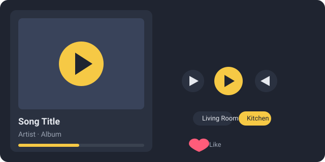

# MusicFlow Card



A Lovelace custom card for the [MusicFlow](https://github.com/ray5378/MusicFlow)
Home Assistant integration. Visually mirrors the **HA native media_player
card** with enhancements specific to MusicFlow:

- **Layout** - two columns. Right column is **full-bleed artwork**. Left
  column holds the cast icon, device name, player switcher, title / artist,
  enhancement buttons, transport controls (power, prev, play-pause, next,
  shuffle, repeat). Progress bar and volume slider sit side-by-side in the
  bottom row - matching the native card.
- **Favorite (heart)** - always clickable; toggles the current track in the
  server's "liked songs", two-way synced via the entity's `liked` attribute.
- **Browse media library** - the library button opens the **HA native
  media browser** for the active entity (more-info dialog). No custom
  browser tree is reinvented.
- **Switch player** - a dropdown at the top right switches the control
  target to any MusicFlow DLNA device or sync group. **The previous player
  keeps playing** (queue + state unchanged) - only the card's control
  focus moves, matching the MusicFlow web client's `switchPeer` behavior.

The card adapts to the light / dark HA theme automatically.

> Chinese docs: [README.zh-CN.md](README.zh-CN.md)

## Requirements

| Component | Minimum |
|---|---|
| MusicFlow integration | **1.2.6** (adds the lyrics and playlists WebSocket commands) |
| MusicFlow server | 1.1.7 or newer |
| Home Assistant | 2024.12 or newer |

## Install

### HACS (recommended)

1. Open the three-dot menu in HACS and choose **Custom repositories**.
2. Add `https://github.com/ray5378/hass-musicflow-card` with category
   **Dashboard** (this is the HACS label for the plugin / frontend
   category).
3. Go to **HACS -> Frontend** and click **Download** on the
   **MusicFlow Card** entry, then reload the Lovelace dashboard (or
   restart Home Assistant).

### Manual

1. Copy `dist/hass-musicflow-card.js` into your `config/www/` directory.
2. Add it as a module resource in **Settings -> Dashboards -> three-dot menu
   -> Resources**: `/local/hass-musicflow-card.js`, type **JavaScript Module**.

After installing, open the dashboard edit mode and choose **Add card** ->
**MusicFlow Player** from the picker. If it does not show up there, type
`musicflow` into the search box - the card registers itself with the HA
frontend so it is discoverable from the GUI (no YAML required).

```yaml
type: custom:musicflow-player-card
entity: media_player.living_room
```

Any MusicFlow media player entity works - a DLNA device or a sync group.

## Usage

Add a card to your dashboard with the following YAML:

```yaml
type: custom:musicflow-player-card
entity: media_player.living_room
```

Or, easier, open the dashboard edit mode, choose **Add card**, and pick
**MusicFlow Player** from the picker (search "musicflow" if needed). The
card has a visual editor: an entity picker lists every `media_player`
entity, so you can just click on the MusicFlow device or sync group you
want to control - no entity id needed.

Any MusicFlow media player entity works - a DLNA device or a sync group.

### Options

| Option | Default | Description |
|---|---|---|
| `entity` | (required) | The MusicFlow media player entity to control |
| `show_artwork` | `true` | Show the album art thumbnail |
| `show_lyrics` | `true` | Show the scrolling lyrics panel |
| `name` | - | Optional card title override |

## Behavior notes

- The **heart** button uses the `musicflow.like_track` service; its state
  comes from the entity's `liked` attribute, refreshed automatically.
- **Add to playlist** opens the playlist picker and calls
  `musicflow.add_to_playlist`. Imported (read-only) playlists are filtered by
  the server.
- **Switch output** uses the built-in `select_source` feature of the
  integration, so the queue and playback position move to the target player.
- Lyrics are fetched once per track via the `musicflow/lyrics` WebSocket
  command and highlighted locally against `media_position`.

## Troubleshooting

| Symptom | Fix |
|---|---|
| `Custom element doesn't exist: musicflow-player-card` (or `not found`) when adding the card | The JS was not loaded as a dashboard resource yet. Check **Settings -> Dashboards -> three-dot menu -> Resources**: HACS should have added `/hacsfiles/hass-musicflow-card/hass-musicflow-card.js` (type **module**) automatically. If the list is empty or the entry is missing, your dashboard may be in **YAML mode** (HACS cannot auto-register resources there) - add the resource manually, or temporarily switch the dashboard to storage mode. Then reload the dashboard (Ctrl/Cmd+R). |
| Card does not show up in the **Add card** picker | The JS resource did not load. Same fix as above - register the resource, then refresh. The card declares itself via `window.customCards`, so once the resource is loaded it appears in the picker (search "musicflow"). |
| `musicflow.like_track` not found when clicking the heart | The integration is older than 1.2.5. Update it via HACS and restart Home Assistant. |
| Lyrics panel says "No lyrics" | The current track has no `.lrc` file alongside it on the server side. The MusicFlow server only fetches lyrics it can find. |
| Add-to-playlist shows an empty dropdown | The server has no playlists yet, or none you can edit. Create one in the MusicFlow web UI first. |

## Related repositories

| Repo | What it is |
|---|---|
| [MusicFlow](https://github.com/ray5378/MusicFlow) | The server: music library, DLNA playback, sync groups |
| [hass-musicflow](https://github.com/ray5378/hass-musicflow) | The HACS integration (media player entities) |
| [hassio-addons](https://github.com/ray5378/hassio-addons) | HA add-on packaging of the server |

## License

MIT
